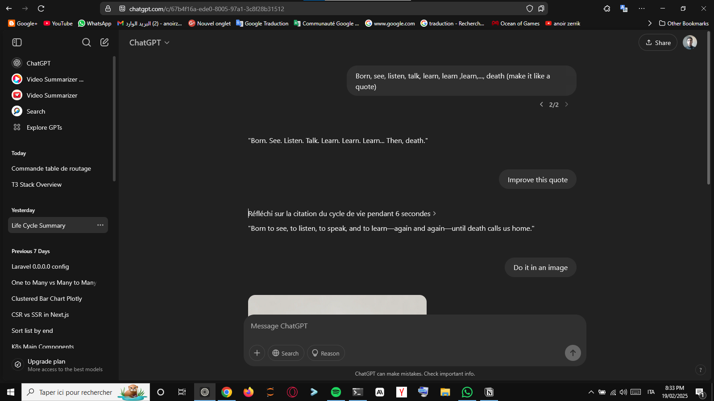

# DataTalk-ai 📊✨



**Your AI-Powered Data Companion for Seamless Data Manipulation, Analysis, and Dashboarding.**

[](https://github.com/your-username/DataTalk-ai/blob/main/LICENSE)
[](https://github.com/your-username/DataTalk-ai)

DataTalk-ai is an AI-powered application designed to assist data experts in manipulating and analyzing data using Large Language Models (LLMs). It provides an intuitive interface, built with Streamlit, to connect to various data sources (SQL databases, CSV, Excel files) and interact with the data through natural language queries and Python code generation.

## Features 🚀

-   **Intuitive Streamlit Interface:** A user-friendly web interface for seamless interaction.
-   **Multi-Source Data Connection:** Connect to various databases (SQLite, MySQL, SQL Server) and file formats (CSV, Excel).
-   **Intelligent LLM Interaction:** Powered by Google Generative AI (Gemini) for natural language understanding and code generation.
-   **SQL Querying & Execution:** Translate natural language into SQL queries, execute them, and display results.
-   **Pandas Data Manipulation:** Perform data cleaning, transformation, and analysis with AI-generated Python (Pandas) code.
-   **Plotly Data Visualization:** Generate a wide range of interactive charts and plots.
-   **Comprehensive Dashboard Creation:** Create integrated HTML dashboards from multiple visualizations.

## How it Works 🧠

DataTalk-ai streamlines data operations through the following key functionalities:

1.  **Data Connection (Streamlit & `core/connection.py`):**
    *   The application leverages Streamlit widgets to enable users to easily connect to various data sources, including SQLite, MySQL, and SQL Server databases via SQLAlchemy and `mysql.connector`/`pyodbc`.
    *   It also supports uploading and processing CSV and Excel files, which are loaded into Pandas DataFrames and then registered as in-memory tables in DuckDB for SQL-like querying.

2.  **LLM Interaction (Google Gemini & `core/llm.py`):**
    *   The core intelligence of DataTalk-ai is powered by the Google Generative AI (Gemini) model, integrated through the `google.generativeai` library.
    *   It interprets user prompts in natural language to generate appropriate SQL queries (for databases or DuckDB for files) or Python code for data manipulation and visualization.
    *   LangChain's `SQLDatabase` utility is used to represent the database schema to the LLM.

3.  **SQL Querying & Execution (`core/execution.py`):**
    *   For connected databases or loaded files (which are processed in-memory using DuckDB), users can pose natural language questions.
    *   The LLM translates these questions into syntactically correct SQL queries, which are then executed using Pandas' `read_sql_query` (for databases) or DuckDB's `execute` method (for files).
    *   Results are displayed in a tabular format.

4.  **Data Manipulation (Pandas & `core/execution.py`):**
    *   Data experts can issue natural language commands to perform various data cleaning, transformation, and analysis tasks on their DataFrames.
    *   The LLM generates the corresponding Python (Pandas) code, which is executed using Python's `exec()` function in a controlled local namespace.
    *   The modified DataFrame is then presented to the user.

5.  **Data Visualization (Plotly & `core/visualization.py`):**
    *   The application enables users to request a wide range of interactive data visualizations.
    *   The LLM generates Plotly code, which is executed to create insightful charts based on the user's requirements and the current state of the data.

6.  **Dashboard Creation (`core/visualization.py`):**
    *   Beyond individual visualizations, DataTalk-ai offers the capability to generate comprehensive HTML dashboards.
    *   These dashboards seamlessly integrate multiple Plotly figures, providing a holistic view of the data insights.

## Installation

To set up DataTalk-ai on your local machine, follow these steps:

1.  **Clone the Repository:**

    ```bash
    git clone https://github.com/your-username/DataTalk-ai.git
    cd DataTalk-ai
    ```

2.  **Create a Virtual Environment (recommended):**

    ```bash
    python -m venv venv
    ```

3.  **Activate the Virtual Environment:**

    *   **On Windows:**

        ```bash
        .\venv\Scripts\activate
        ```
    *   **On macOS/Linux:**

        ```bash
        source venv/bin/activate
        ```

4.  **Install Dependencies:**

    ```bash
    pip install -r requirements.txt
    ```

5.  **Set Up Google Gemini API Key:**
    *   Obtain a Google Gemini API key from the Google AI Studio.
    *   Create a `.env` file in the root directory of the project.
    *   Add your API key to the `.env` file:

        ```
        GOOGLE_API_KEY=YOUR_API_KEY
        ```

6.  **Run the Application:**

    ```bash
    streamlit run app.py
    ```

    The application will open in your default web browser.

## Usage

Once the application is running, you can start interacting with your data. Here's a brief guide:

1.  **Connect to a Data Source:**
    *   On the left sidebar, select the type of data source you want to connect to (SQL Database, CSV, or Excel).
    *   Provide the necessary connection details or upload your file.
    *   Click the "Connect" or "Upload" button.

2.  **Interact with Data (Querying, Manipulation, Visualization):**
    *   Once connected, you will see a chat interface and a data display area.
    *   **Natural Language Queries:** Type your questions or commands in natural language (e.g., "Show me the top 10 customers by sales," "Clean the 'price' column by removing null values," "Create a bar chart of product categories").
    *   **Code Generation:** The AI will generate and execute the appropriate SQL or Python (Pandas/Plotly) code based on your input.
    *   **View Results:** The results (tables, modified DataFrames, or charts) will be displayed in the main area.

    **Special Commands:**
    *   `+ [natural language query]`: Use this prefix for data manipulation (SQL queries for databases, or DataFrame manipulation for loaded files).
    *   `- [natural language plot request]`: Use this prefix to generate Plotly visualizations from your current DataFrame.
    *   `* [natural language code request]`: Use this prefix to generate and execute general Python code.
    *   `/editor`: Opens a code editor to manually modify and execute generated SQL or Python code.
    *   `/NB [notebook_name]`: Exports the current chat history's generated code into a Jupyter Notebook (.ipynb) file.
    *   `/dash`: Initiates the dashboard creation process, allowing you to select plots to include.
    *   `/replace [table_name]`: Replaces an existing in-memory DuckDB table with the current DataFrame (useful after manipulations).
    *   `/backup`: Reverts the DataFrame to its state before the last data manipulation.

3.  **Create Dashboards:**
    *   You can request the AI to create a dashboard by asking something like, "Create a dashboard showing sales trends and customer demographics."
    *   The application will generate an HTML dashboard with integrated visualizations.

## Project Structure

The project is organized into the following main directories:

-   `app.py`: The main Streamlit application file.
-   `core/`: Contains the core logic and functionalities of the application.
    -   `connection.py`: Handles database and file connections.
    -   `execution.py`: Manages the execution of generated SQL and Python code.
    -   `llm.py`: Interfaces with the Google Generative AI (Gemini) model.
    -   `utils.py`: Contains utility functions.
    -   `visualization.py`: Responsible for generating Plotly visualizations and HTML dashboards.
-   `static/`: Stores static assets like images (e.g., `chart.png`).
-   `ui/`: Contains the user interface components.
    -   `connection_page.py`: Streamlit components for data source connection.
    -   `query_interface.py`: Streamlit components for the chat and data display.
-   `requirements.txt`: Lists all Python dependencies.
-   `README.md`: This project documentation file.

## Contributing 👋

We welcome contributions to DataTalk-ai! If you'd like to contribute, please follow these guidelines:

1.  **Fork the repository.**
2.  **Create a new branch** for your feature or bug fix.
3.  **Make your changes** and ensure they adhere to the project's coding style.
4.  **Write clear commit messages.**
5.  **Submit a pull request** with a detailed description of your changes.

## License 📄

This project is licensed under the MIT License - see the [LICENSE](LICENSE) file for details.